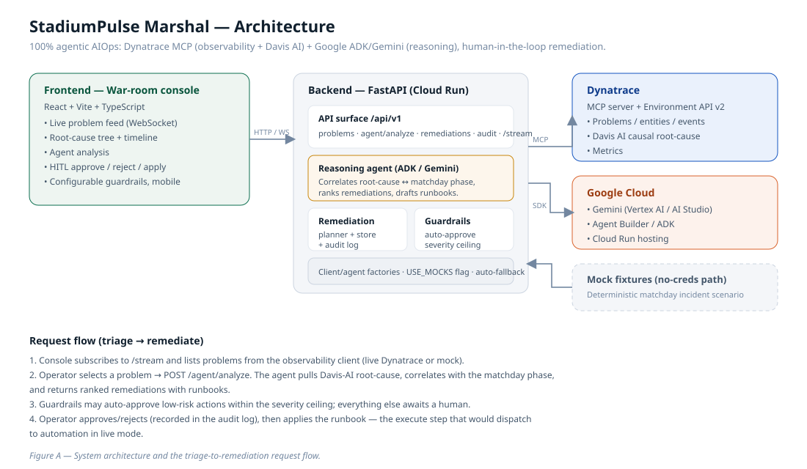

# Architecture & API Reference — StadiumPulse Marshal



## Design principles

1. **100% agentic, partner-first.** Observability and causal root-cause come
   from the **Dynatrace MCP server / Davis AI**; reasoning comes from
   **Google ADK / Gemini**. The agent is grounded in real Dynatrace facts rather
   than asked to invent infrastructure.
2. **Mock-first, live-ready.** Every external dependency has a real client *and*
   a mock behind one `USE_MOCKS` flag, with independent per-subsystem fallback.
   The app runs end-to-end with zero credentials and flips to live data when
   keys are present.
3. **Human-in-the-loop by default.** The agent recommends; a person decides.
   Optional guardrails auto-approve only low-risk actions within a severity
   ceiling. Every decision is audited.
4. **Single interface, swappable internals.** `ObservabilityClient` and
   `ReasoningAgent` are abstract; mock and live implementations are
   interchangeable, selected by factories.

## Module map

```
backend/app
├── core/            config (USE_MOCKS), logging, app context, static serving
├── models/          enums + Pydantic domain models (Problem, RootCauseNode, …)
├── fixtures/        deterministic matchday incident scenario
├── mcp/             ObservabilityClient: base · mock · Dynatrace (live) · factory
├── agent/           ReasoningAgent: base/mock · Gemini (live) · factory
├── services/        remediation planner · store (decisions + audit + guardrails)
├── api/             schemas · routes
└── main.py          FastAPI app, lifespan, WebSocket /stream, frontend mount

frontend/src
├── types/           TS mirrors of the domain
├── api/             fetch client
├── components/      RootCauseTree · Timeline · RemediationCard · SettingsPanel
├── styles/          design system
└── App.tsx          console composition
```

## Data flow

1. **Feed.** `GET /problems` (+ WebSocket `/stream`) via the observability
   client (Dynatrace live or mock).
2. **Analyze.** `POST /agent/analyze/{id}` → agent localises root cause,
   correlates with the matchday phase, ranks remediations, registers them, and
   applies auto-approve guardrails.
3. **Decide.** `POST /remediations/{id}/approve|reject` → audited decision.
4. **Apply.** `POST /remediations/{id}/execute` → transitions to EXECUTED
   (dispatches the runbook in live mode). Requires prior approval (else 409).

## API reference (`/api/v1`)

| Method | Path | Purpose |
|---|---|---|
| GET | `/health` | Liveness. |
| GET | `/config` | Mode, backends, guardrail state. |
| GET | `/problems?open_only=` | List problems. |
| GET | `/problems/{id}` | One problem (404 if absent). |
| GET | `/entities` | Monitored entities. |
| GET | `/timeline` | Matchday fixture timeline. |
| POST | `/agent/analyze/{id}` | Agent analysis + remediations (404 if absent). |
| GET | `/remediations?pending=` | Remediation actions. |
| POST | `/remediations/{id}/approve` | Approve (audited). |
| POST | `/remediations/{id}/reject` | Reject (audited). |
| POST | `/remediations/{id}/execute` | Apply approved action (409 if not approved). |
| GET | `/audit` | Decision audit log. |
| PATCH | `/settings` | Update guardrails at runtime. |
| WS | `/stream` | Live open-problem feed. |

Interactive OpenAPI docs are served at `/docs` when the backend runs.

## Why these technologies (and the alternative)

**Dynatrace** is chosen for *causal* AIOps: Davis AI auto-instruments the stack
and localises the responsible entity, which beats hand-tuned metric dashboards
under matchday alert noise — and it is exposed over MCP for agentic use. The
alternative (Prometheus + Grafana + manual correlation, or Datadog) gives
correlation, not causation, so the agent would localise more slowly.

**Google ADK / Gemini** provides the reasoning and runbook drafting with
human-in-the-loop control via Agent Builder, hosted on Cloud Run. The agent is
deliberately grounded with deterministic candidate remediations so the LLM
selects and explains rather than fabricates.

## Testing

- **Backend:** `pytest --cov=app` → **100%** statement coverage (66 tests).
- **E2E:** Playwright specs across desktop + mobile projects (see
  `E2E_TESTING.md`). The single-origin stack they drive is validated by an HTTP
  smoke test.

---

## Phase 2 — Enterprise Depth

Phase 2 extends the vertical slice into an operations platform. New, strictly
modular subsystems:

### Domain (`app/models/`)
- `slo.py` — SLI / SLO / SLOMeasurement / ErrorBudget with burn-state.
- `incident.py` — Incident with a validated lifecycle state machine
  (`DETECTED → ACKNOWLEDGED → INVESTIGATING → MITIGATING → RESOLVED → POSTMORTEM
  → CLOSED`), escalation tiers, and a timeline.
- `notification.py` — on-call engineers, escalation policies, notifications.
- `venue.py` — venues, matches, matchday context (multi-venue).

### Persistence (`app/repositories/`)
Repository pattern with two interchangeable backends behind one factory:
in-memory and SQLAlchemy/SQLite (async). Services depend only on the interfaces
(`base.py`); the same contract tests pass against both backends.

### MCP protocol (`app/mcp/`)
- `protocol.py` — a real MCP JSON-RPC 2.0 client: `initialize`, `tools/list`,
  `tools/call`, content extraction, typed errors.
- `dynatrace_mcp_adapter.py` — uses the MCP session to satisfy
  `ObservabilityClient`, mapping tool results into the domain. The factory now
  prefers MCP-protocol → Environment-API → mock.

### Services (`app/services/`)
- `slo_engine.py` — error-budget + **burn-rate** computation. Burn rate is the
  current error rate over a short observation window divided by the
  budget-neutral rate, so fast/slow burn is detected before cumulative
  exhaustion. Classification is ordered by urgency (fast burn first).
- `incident_service.py` — orchestrates lifecycle, assignment, escalation and
  notification dispatch, and links remediation decisions onto the timeline.
- `escalation_engine.py` — policy-driven tier escalation + on-call routing.
- `notification_service.py` — builds and dispatches notifications.
- `analytics.py` — MTTR/MTTA and breakdowns by severity/state/venue.
- `ops_defaults.py` — default escalation policies, on-call roster, synthetic SLO
  measurements for mock mode.

### Scenarios (`app/fixtures/scenarios/`)
Four selectable matchday scenarios (payment DB saturation, CDN edge failure,
network partition, k8s OOM) across three venues, behind a registry. The mock
observability client is scenario-aware and switchable at runtime.

### API additions (`/api/v1`)
| Method | Path | Purpose |
|---|---|---|
| GET/POST | `/incidents` | List (paginated) / create from a problem. |
| GET | `/incidents/{id}` | Fetch one. |
| POST | `/incidents/{id}/transition` | Lifecycle change (409 on illegal). |
| POST | `/incidents/{id}/assign` `/note` `/escalate` | Ops actions. |
| GET | `/slo` | Error budgets with burn state. |
| GET | `/analytics` | Operational metrics. |
| GET | `/notifications` | Dispatched notifications (optionally by incident). |
| GET/POST | `/scenarios` `/scenarios/select` | List / switch scenario. |

Auth: when `auth_enabled`, all routes require an `X-API-Key` or a valid Bearer
JWT (`jwt_secret`). Pagination via `offset`/`limit`.

### Frontend
Refactored into a tab shell (`App.tsx`) plus page modules
(`pages/TriagePage`, `IncidentsPage`, `ReliabilityPage`, `ScenariosPage`) and new
components (`SLODashboard`, `AnalyticsPanel`, `ScenarioSwitcher`,
`IncidentLifecycle`).

### Testing
**135 tests, 100% backend statement coverage**, including a parametrised
repository contract suite run against both persistence backends.

---

## Phase 3 — Production Hardening

### Cross-cutting (`app/middleware/`, `app/core/errors.py`)
- **Standard error envelope** — every error response is
  `{"error":{"code","message","request_id","details"}}` via centralised
  exception handlers (`AppError` subclasses, HTTPException, validation, and a
  catch-all).
- **Correlation IDs** — `CorrelationIdMiddleware` assigns/propagates an
  `X-Request-ID` (stored in a context var, echoed on the response, attached to
  logs and error envelopes).
- **Request metrics + timing log** — `RequestMetricsMiddleware`.

### Self-observability (`app/observability/`, `app/api/routes_observability.py`)
- Dependency-free Prometheus metrics registry (counters + histograms):
  request totals/durations, incidents created, remediation decisions, events
  published, webhook deliveries.
- `GET /api/v1/metrics` (Prometheus text), `GET /api/v1/health` (liveness),
  `GET /api/v1/ready` (readiness with per-dependency state).

### RBAC (`app/rbac/`, `app/api/auth.py`)
- Roles (viewer / operator / responder / admin) → fine-grained permissions.
- `require_permission(Permission.X)` dependency guards routes; API-key→roles and
  JWT-claims→roles mapping. Auth-disabled requests act as a full-access admin.

### Event bus + webhooks (`app/events/`, `app/services/webhook_service.py`)
- Async in-process event bus; domain events emitted on incident lifecycle
  changes. Webhook subscriptions + an event-driven delivery dispatcher (records
  status/failures, never raises). `POST/GET/DELETE /api/v1/webhooks`.

### Rate limiting (`app/middleware/ratelimit.py`)
- Per-principal/IP token bucket → 429 + `Retry-After`. Monitoring endpoints
  exempt. Enabled via `RATE_LIMIT_ENABLED`.

### Analysis (`app/services/slo_history.py`, `postmortem.py`; `routes_analysis.py`)
- SLO snapshot history + burn-rate trends (`GET /api/v1/slo/trends`).
- Postmortem generator (timeline → structured doc + markdown)
  (`GET /api/v1/incidents/{id}/postmortem`).
- Incident search/filter (`GET /api/v1/incidents-search`) and bulk transition
  (`POST /api/v1/incidents-bulk/transition`).

### Frontend (`src/store/`, `src/hooks/`, new pages/components)
- Global store (context + reducer), toast store, error boundary.
- Live WebSocket feed hook + topbar indicator.
- Webhooks admin page, postmortem viewer, SLO trend sparklines, new Webhooks tab.

### Testing
**187 tests, 100% backend statement coverage**, including middleware, metrics,
RBAC, event bus, webhooks, rate limiting, SLO history, postmortems, and the new
routes.

---

## Phase 4 — Reliability & Distributed-Systems Correctness

### Transactional outbox (`app/models/outbox.py`, `app/services/outbox_relay.py`)
Domain events are written to a durable outbox in the same store as the state
change, then an `OutboxRelay` drains PENDING entries to the event bus and marks
them DISPATCHED. This gives at-least-once delivery that survives a crash between
DB commit and delivery — no lost events. Both memory and SQL outbox repos.

### Webhook retry / dead-letter (`app/services/webhook_service.py`)
Delivery now retries with bounded exponential backoff; after `max_attempts`
consecutive failures the subscription is **dead-lettered** (excluded from
matching until redriven). Every attempt is recorded in a per-subscription
delivery log. Endpoints: `GET /webhooks/dead-letter/list`,
`POST /webhooks/{id}/redrive`.

### Idempotency (`app/services/idempotency.py`)
`Idempotency-Key` on incident creation → first call executes and stores the
response; replays return the stored response with no duplicate side effect.
Keys are namespaced per operation; LRU-bounded store.

### Optimistic concurrency (`app/models/incident.py`, incident service)
Incidents carry a `version`; transitions accept `expected_version` and raise
`StaleVersionError` → **409** when the version is stale, preventing silent
lost-update races between concurrent operators.

### First-class audit log (`app/models/audit.py`, `app/services/audit_service.py`)
Every mutation records an `AuditEntry` (actor, action, resource, before/after).
Time-sortable ids double as opaque pagination cursors. Queryable + cursor-paged
via `GET /audit-log`. Memory and SQL repos; survives restart under SQL.

### Trace context (`app/middleware/tracing.py`)
W3C `traceparent` is parsed and continued (or a new trace is started), a child
span id is generated, the trace id is echoed on responses and included in error
envelopes — interoperable with OpenTelemetry collectors.

### Cursor pagination (`app/api/routes_audit.py`)
Opaque, stable cursors (`next_cursor` / `has_more`) walk large sets without
duplicates or gaps under concurrent inserts.

### Config self-check + active readiness (`app/core/config.py`)
`validate_for_startup()` fails fast with a clear message on inconsistent config
(auth without secret, live mode without a backend, bad limits). `/ready` now
actively probes the observability client and persistence rather than reporting
static state.

### Frontend (`src/api/http.ts`, new pages/components)
- **Resilient HTTP layer**: typed `ApiError` from the error envelope, retry with
  backoff on transient failures (GET), and `AbortController` cancellation.
- **Optimistic updates with rollback** and version-aware transitions (409 →
  refresh + toast) on the Incidents page.
- **Idempotent incident creation** with client-generated keys.
- **Audit log page** (cursor-paged, filterable, request-cancelling).
- **Dead-letter panel** with redrive on the Webhooks page.
- **Skeleton loaders** and basic **accessibility** (sr-only labels, aria-busy,
  labelled controls).

### Testing
**220 tests, 100% backend statement coverage**, including the outbox + relay,
webhook retry/dead-letter/redrive, idempotency, optimistic concurrency, audit
(memory + SQL), trace parsing, cursor pagination, and config self-check.
