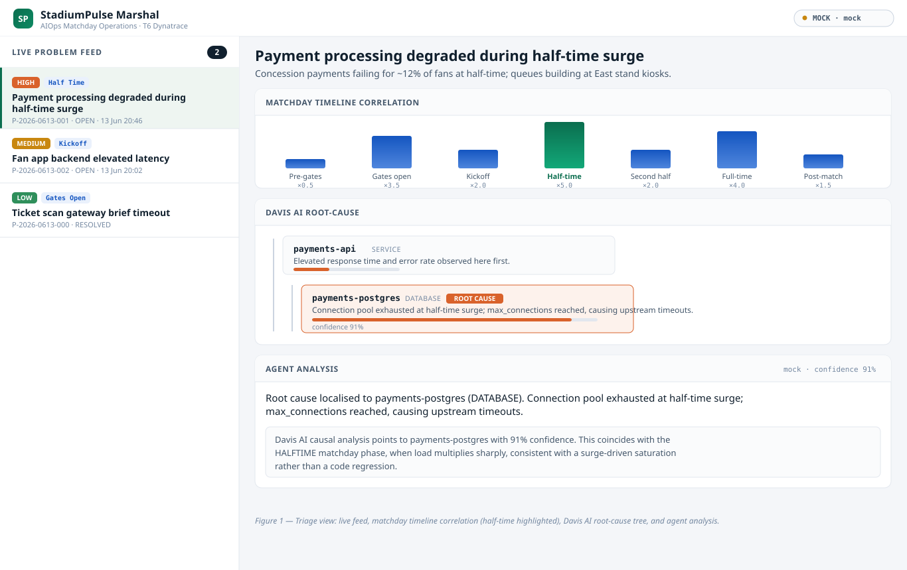
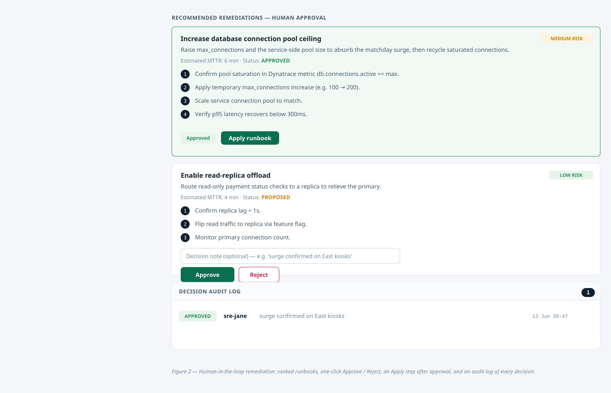
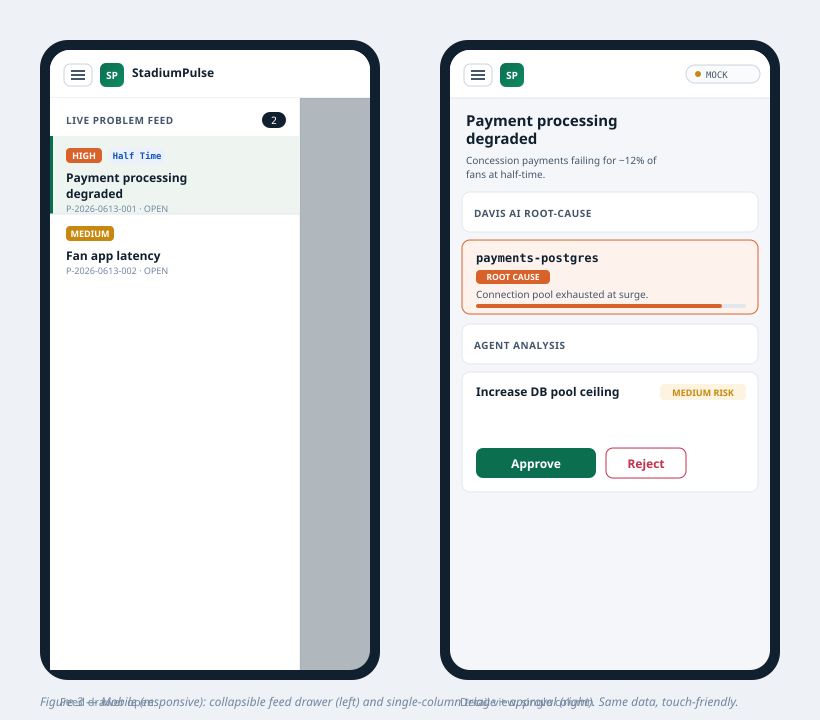
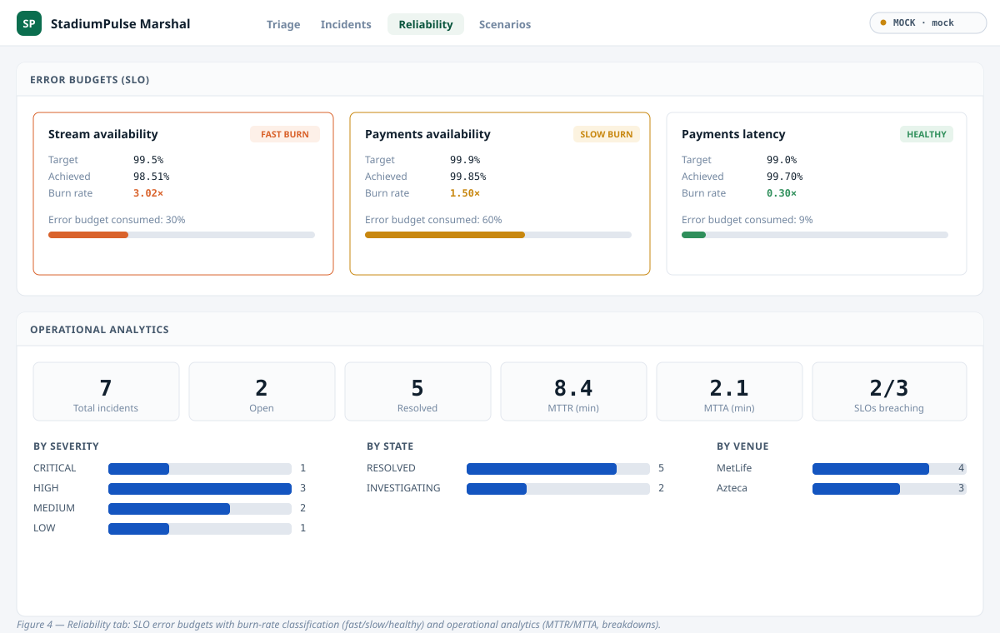

# StadiumPulse Marshal — User Guide

**Version 1.0.0 · Google Cloud Rapid Agent Hackathon (AT-Hack0025) · T6 Dynatrace**

StadiumPulse Marshal is an AIOps agent for 2026 World Cup matchday operations.
It watches matchday digital systems (ticket scanning, payments, app backends,
networks), uses Dynatrace Davis AI to localise the *causal* root of a problem,
correlates it with where you are in the match timeline, and proposes ranked
remediation runbooks that an SRE approves with one click.

---

## Contents
1. Concepts
2. Running the app
3. The console, screen by screen
4. Triaging an incident (step by step)
5. Approving and applying a remediation
6. Configuring guardrails
7. Mobile use
8. Live vs mock mode
9. Troubleshooting

---

## 1. Concepts

| Term | Meaning |
|---|---|
| **Problem** | A Dynatrace-detected incident (e.g. payment latency spike). |
| **Davis AI root-cause** | Dynatrace's *causal* localisation of the entity actually responsible — not just correlated symptoms. |
| **Matchday phase** | Where the match is (gates open, kickoff, half-time…). Each phase has an expected load multiplier; surges explain many incidents. |
| **Agent analysis** | The Gemini/ADK agent's summary, confidence, and reasoning, grounding the LLM in real Dynatrace facts. |
| **Remediation** | A proposed fix with a numbered runbook, risk level and estimated MTTR. |
| **Human-in-the-loop (HITL)** | You approve, reject, then apply. High-impact actions always require a person. |
| **Guardrail** | Optional auto-approval of low-risk actions within a severity ceiling. |

---

## 2. Running the app

### 2.1 Backend (API + agent)
```bash
cd backend
pip install -e .            # or: pip install -e .[agent] for the live Gemini SDK
python -m uvicorn app.main:app --port 8000
```
The backend prints its mode on start, e.g.
`StadiumPulse Marshal v1.0.0 started (data_source=mock, agent=mock)`.

### 2.2 Frontend
For development with hot reload:
```bash
cd frontend
npm install
npm run dev        # http://localhost:5173, proxies /api to :8000
```
For a single-origin build (the backend serves the UI):
```bash
cd frontend && npm run build
# then open http://localhost:8000  (backend serves frontend/dist)
```

> With no credentials the app runs fully on the **mock matchday scenario**, so
> you can explore every screen immediately.

---

## 3. The console, screen by screen



*Figure 1.* The console has three regions:

1. **Top bar** — product identity and a **mode badge** showing the data source
   (`MOCK` / `LIVE`) and agent backend (`mock` / `gemini`).
2. **Live problem feed** (left) — every problem, newest-first, with a severity
   tag, matchday phase, ID and status. The count pill shows open problems.
3. **Detail** (right) — for the selected problem: matchday-timeline correlation,
   problem context, the Davis AI root-cause tree, the agent analysis, the
   remediation recommendations, settings, and the audit log.

---

## 4. Triaging an incident (step by step)

1. **Open the console.** The first open problem is selected automatically.
2. **Read the impact line** under the title (e.g. *"Concession payments failing
   for ~12% of fans at half-time"*).
3. **Check the timeline.** The highlighted (green) bar is the current matchday
   phase. A tall bar means a big expected load multiplier — context for why a
   surge-driven incident is happening now (half-time is ×5.0).
4. **Inspect the root cause.** The tree descends from the symptom service to the
   flagged **ROOT CAUSE** entity. In the demo scenario that is
   `payments-postgres` at **91% confidence** — a connection-pool exhaustion.
5. **Read the agent analysis.** The agent states the root cause in plain
   language and explains *why* (half-time surge saturation, not a code
   regression), with a confidence score.

---

## 5. Approving and applying a remediation



*Figure 2.* Each recommendation shows a title, risk tag, estimated MTTR and a
numbered runbook.

1. **Review the runbook.** Steps are concrete and ordered.
2. *(Optional)* **Add a decision note**, e.g. "surge confirmed on East kiosks".
   It is stored on the audit record.
3. **Approve** or **Reject.** Rejecting records the decision and stops there.
4. After approval an **Apply runbook** button appears. Click it to mark the
   action executed (in live mode this dispatches the runbook to your automation
   backend). The card shows **Runbook applied**.
5. **Audit log.** Every decision — who, what, when, why, and whether it was
   automatic — is appended at the bottom of the detail pane.

---

## 6. Configuring guardrails

In the **Operator & guardrails** panel:

1. **Operator identity** — the name recorded on each decision. Set it to your
   handle before approving.
2. **Auto-approve low-risk actions** — when enabled, LOW-risk actions within the
   severity ceiling are applied automatically (shown as **AUTO_APPROVED**), so
   your attention is reserved for high-impact calls. The toggle is sent to the
   backend immediately. High-risk actions are *never* auto-approved.

---

## 7. Mobile use



*Figure 3.* On a phone the layout collapses to a single column:

1. Tap the **☰ menu** in the top bar to slide out the problem feed.
2. Tap a problem; the drawer closes and the detail fills the screen.
3. All actions — approve, reject, apply, guardrails — are touch-friendly.

---

## 8. Live vs mock mode

The mode badge tells you which data path is active. To go live, set credentials
(see `ACCESS_REQUIREMENTS.md`) and `USE_MOCKS=false`. Each subsystem falls back
independently: with only Dynatrace credentials you get live observability and a
mock agent, and vice-versa.

---

## 9. Troubleshooting

| Symptom | Cause / fix |
|---|---|
| Badge stuck on `MOCK` after adding creds | Ensure `USE_MOCKS=false` and restart the backend. Check `/api/v1/config`. |
| Empty problem feed | Backend not reachable; confirm it runs on :8000 and the proxy/origin is correct. |
| `Gemini init failed … falling back to mock` | The `google-genai` SDK isn't installed or creds are invalid. Install `.[agent]` and verify the key/project. |
| Apply button missing | The action must be **approved** first (or auto-approved by a guardrail). |
| Execute returns 409 | Same — approve before applying. |

---

## 10. Phase 2 — Incidents, Reliability & Scenarios (tabs)

The console is organised into four tabs in the top bar.

### Triage
The original single-screen triage view (Section 3–5): feed, root cause, agent
analysis, human-in-the-loop remediation.

### Incidents
Turn a detected problem into a tracked **incident** with a full lifecycle.

1. Open the **Incidents** tab.
2. Under *Create incident from open problem*, click **Open incident** next to a
   problem.
3. The incident detail shows its state, escalation tier, assignee and a
   timeline.
4. Use the **→ STATE** buttons to advance the lifecycle (Acknowledge →
   Investigate → Mitigate → Resolve). Illegal transitions are blocked.
5. **Escalate** applies the escalation policy for the incident's age/severity
   and pages the on-call engineer; the page is recorded on the timeline and in
   notifications.

### Reliability



*Figure 4.* Shows **error budgets** for each SLO with a burn-state badge
(Healthy / Slow burn / Fast burn / Budget exhausted) and the burn rate, plus
**operational analytics**: MTTR, MTTA, incident counts and breakdowns by
severity, state and venue.

> Burn rate is the current error rate divided by the rate that would exactly
> exhaust the budget over the SLO window. A burn rate of 3× means you'd exhaust
> the budget in a third of the window — surfaced as a fast burn even while most
> of the budget remains.

### Scenarios
Switch the active matchday situation (payment DB saturation, CDN edge failure,
network partition, Kubernetes OOM) across three venues. Selecting a scenario
updates the problem feed, root-cause data and SLOs across every tab.

---

## 11. Persistence & authentication (operations)

- **Persistence.** By default the app runs in-memory. Set `DATABASE_URL`
  (e.g. `sqlite+aiosqlite:///stadiumpulse.db`) to persist incidents,
  remediations, audit and notifications durably. No code change required.
- **Authentication.** Set `AUTH_ENABLED=true` plus `API_KEY` and/or
  `JWT_SECRET`. Then send `X-API-Key: <key>` or `Authorization: Bearer <jwt>`
  on API calls. Left off by default for the demo.

---

## 12. Phase 3 — Webhooks, live feed, postmortems, trends

### Webhooks tab
Register external endpoints to receive incident/SLO events.

1. Open the **Webhooks** tab.
2. Enter an endpoint URL, optionally tick the event types to receive (leave all
   unticked for every event), and click **Register webhook**.
3. Registered webhooks show their last delivery status and failure count.
   Delete with the **Delete** button.

Events emitted: `incident.created`, `incident.state_changed`,
`incident.escalated`, `incident.assigned`, `remediation.decided`,
`slo.breached`.

### Live feed indicator
The top bar shows a live indicator (`live (N)` / `offline`) backed by a
WebSocket to `/api/v1/stream`. It reflects the current open-problem count and
reconnects automatically.

### Postmortems
On the **Incidents** tab, open an incident and click **Generate postmortem** to
produce a structured postmortem (summary, metrics, timeline, remediations) with
a markdown export you can copy.

### SLO trends
The **Reliability** tab now includes burn-rate trend sparklines per SLO with
direction (improving / worsening / stable) and aggregate stats.

---

## 13. Operations reference (Phase 3)

### Health & metrics
- `GET /api/v1/health` — liveness probe.
- `GET /api/v1/ready` — readiness with dependency states.
- `GET /api/v1/metrics` — Prometheus exposition (scrape target).

### RBAC
Set `AUTH_ENABLED=true`. Roles: `viewer` (read), `operator` (+ incident write,
scenarios), `responder` (+ remediation approve), `admin` (all, incl. webhooks).
- API key: set `API_KEY`; granted roles via `API_KEY_ROLES` (default `admin`).
- JWT: set `JWT_SECRET`; roles read from the `JWT_ROLES_CLAIM` claim
  (default `roles`).

### Rate limiting
`RATE_LIMIT_ENABLED=true` with `RATE_LIMIT_PER_MINUTE` (default 120). Over-limit
returns `429` with a `Retry-After` header. `/metrics`, `/health` and `/ready`
are never throttled.

### Tracing
Every response includes an `X-Request-ID`. Send your own to correlate across
systems; it is echoed back and attached to logs and error envelopes.
